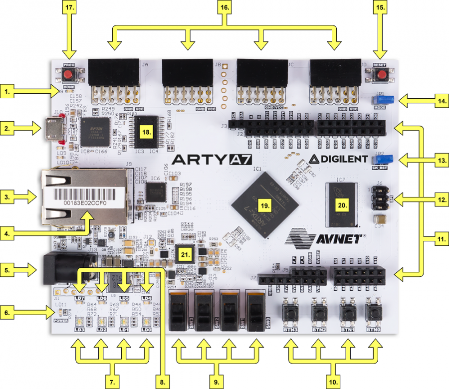

# Console for exercise bike/bike

### Team members

* Mohamad Alkanan
* Tarik Alkanan
* Dominik Baláž
* Samuel Bartko

[Link to your GitHub project folder]( http://github.com/xxx)

### Project objectives

Console for exercise bike/bike, hall sensor, measuring and displaying speed, distance traveled, etc.


## Hardware description

### (1).Board used for this is Arty A7: Artix-7. The picture under shows the board with marked components. 


<div class="table sectionedit3"><table class="inline">
	<thead>
	<tr class="row0">
		<th class="col0 leftalign"> Callout  </th><th class="col1 leftalign"> Description                              </th><th class="col2 leftalign"> Callout  </th><th class="col3 leftalign"> Description                           </th><th class="col4 leftalign"> Callout  </th><th class="col5 leftalign"> Description                               </th>
	</tr>
	</thead>
	<tr class="row1">
		<td class="col0 leftalign"> 1        </td><td class="col1 leftalign"> FPGA programming DONE <abbr title="Light Emitting Diode">LED</abbr>                </td><td class="col2 leftalign"> 8        </td><td class="col3 leftalign"> User RGB LEDs                         </td><td class="col4 leftalign"> 15       </td><td class="col5 leftalign"> chipKIT processor reset                   </td>
	</tr>
	<tr class="row2">
		<td class="col0 leftalign"> 2        </td><td class="col1 leftalign"> Shared USB JTAG / UART port              </td><td class="col2 leftalign"> 9        </td><td class="col3 leftalign"> User slide switches                   </td><td class="col4 leftalign"> 16       </td><td class="col5 leftalign"> Pmod connectors                           </td>
	</tr>
	<tr class="row3">
		<td class="col0 leftalign"> 3        </td><td class="col1 leftalign"> Ethernet connector                       </td><td class="col2 leftalign"> 10       </td><td class="col3 leftalign"> User push buttons                     </td><td class="col4 leftalign"> 17       </td><td class="col5 leftalign"> FPGA programming reset button             </td>
	</tr>
	<tr class="row4">
		<td class="col0 leftalign"> 4        </td><td class="col1 leftalign"> MAC address sticker                      </td><td class="col2 leftalign"> 11       </td><td class="col3 leftalign"> Arduino/chipKIT shield connectors     </td><td class="col4 leftalign"> 18       </td><td class="col5 leftalign"> SPI flash memory                          </td>
	</tr>
	<tr class="row5">
		<td class="col0 leftalign"> 5        </td><td class="col1 leftalign"> Power jack for optional external supply  </td><td class="col2 leftalign"> 12       </td><td class="col3 leftalign"> Arduino/chipKIT shield SPI connector  </td><td class="col4 leftalign"> 19       </td><td class="col5 leftalign"> Artix FPGA                                </td>
	</tr>
	<tr class="row6">
		<td class="col0 leftalign"> 6        </td><td class="col1 leftalign"> Power good <abbr title="Light Emitting Diode">LED</abbr>                           </td><td class="col2 leftalign"> 13       </td><td class="col3 leftalign"> chipKIT processor reset jumper        </td><td class="col4 leftalign"> 20       </td><td class="col5 leftalign"> Micron DDR3 memory                        </td>
	</tr>
	<tr class="row7">
		<td class="col0 leftalign"> 7        </td><td class="col1 leftalign"> User LEDs                                </td><td class="col2 leftalign"> 14       </td><td class="col3 leftalign"> FPGA programming mode                 </td><td class="col4 leftalign"> 21       </td><td class="col5 leftalign"> Dialog Semiconductor DA9062 power supply  </td>
	</tr>
</table></div>

### (2).Hall sensor (module KY-024)                   (3). Seven segmet display.


[link for hall sensor](https://dratek.cz/arduino/7702-halluv-senzor-modul-ky-024.html?gclid=Cj0KCQjwvr6EBhDOARIsAPpqUPFmX-NV1Sm-jNOxffSL-m0-NFdAKmShf-2nILrmdBjUIOiNXTs1npMaAtw9EALw_wcB)\
[Link for display ](https://store.digilentinc.com/pmod-ssd-seven-segment-display/)

   ![Display]


## The wiring diagram looks like this.

### Tables with connections on Board
| **Hall sensor connector** | **Pin on board** |
| :-: | :-: |
| Digital Out | IO1 |
| Analog Out | A2 |
| VCC | 5V0 |
| Ground | GND |

***Here we see how does hall sensor work*** \


## VHDL modules description and simulations

### Modul `hex_7_seg`
```vhdl

library IEEE;
use IEEE.STD_LOGIC_1164.ALL;

entity hex_7seg is
    Port ( 
           hex_i : in STD_LOGIC_VECTOR  (4 - 1 downto 0); --Input binary data
           seg_o : out STD_LOGIC_VECTOR (7 - 1 downto 0)  --Cathode values in the order A, B, C, D, E, F, G
         );
end hex_7seg;

architecture Behavioral of hex_7seg is

begin

--------------------------------------------------------------------
    -- p_7seg_decoder:
    -- A combinational process for 7-segment display decoder. 
    -- Any time "hex_i" is changed, the process is "executed".
    -- Output pin seg_o(6) corresponds to segment A, seg_o(5) to B, etc.
    --------------------------------------------------------------------
    p_7seg_decoder : process(hex_i)
    begin
        case hex_i is
            when "0000" =>
                seg_o <= "0000001";     -- 0
            when "0001" =>
                seg_o <= "1001111";     -- 1
            when "0010" =>
                seg_o <= "0010010";     -- 2
            when "0011" =>
                seg_o <= "0000110";     -- 3
            when "0100" =>
                seg_o <= "1001100";     -- 4
            when "0101" =>
                seg_o <= "0100100";     -- 5
            when "0110" =>
                seg_o <= "0100000";     -- 6
            when "0111" =>
                seg_o <= "0011111";     -- 7
            when "1000" =>
                seg_o <= "0000000";     -- 8
            when "1001" =>
                seg_o <= "0000100";     -- 9
            when "1010" =>
                seg_o <= "0001000";     -- A
            when "1011" =>
                seg_o <= "1100000";     -- B
            when "1100" =>
                seg_o <= "0110001";     -- C
            when "1101" =>
                seg_o <= "1000010";     -- D        
            when "1110" =>
                seg_o <= "0110000";     -- E
            when others =>
                seg_o <= "0111000";     -- F
        end case;
    end process p_7seg_decoder;

end Behavioral;

```

## TOP module description and simulations

Write your text here.


## Video
